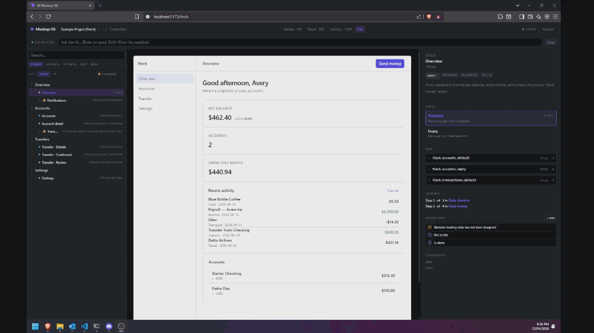

<div align="center">

# Mockup OS

**Build the entire frontend — before the backend even exists.**

[](LICENSE)
[](ROADMAP.md)
[](CONTRIBUTING.md)



[Quick start](#quick-start) · [What it is](#what-is-mockup-os) · [Output](#what-comes-out-of-mockup-os) · [Architecture](#architecture) · [Roadmap](ROADMAP.md) · [Contributing](CONTRIBUTING.md)

</div>

---

## Building UI shouldn’t be this slow

Most teams don’t struggle with ideas.  
They struggle turning those ideas into something real.

You sketch it.  
You mock it up.  
You explain it.  
Then someone rebuilds it from scratch.

That cycle is slow, lossy, and unnecessary.

---

## What if you could just build it directly?

Mockup OS lets you go from idea → working frontend instantly.

- Generate real React screens with AI  
- Navigate them like a real product  
- Validate flows, states, and edge cases early  
- Iterate without design handoffs  

No wireframes.  
No translation.  
No redesign cycle.

---

## What is Mockup OS?

Mockup OS is a **code-first system for building complete frontends as real applications** — before any backend exists.

- Real routes  
- Real components  
- Real state  
- Real flows  

Everything behaves like the final product.

AI operates inside a **validated system**, ensuring consistency across the entire UI.

---

## The shift

Instead of:

idea → design → redesign → dev → rework → ship

You get:

idea → real frontend → validate → export → build backend → ship

---

## What comes out of Mockup OS

Mockup OS produces a **versioned frontend system** that can be handed directly to engineering.

Each output includes:

- JSX screens (real routes)
- Shared components
- Layouts and UI patterns
- Themes and tokens
- Feature definitions
- Fixture data
- Structured product brief
- Snapshot artifacts

This is not a mockup.

**It’s a complete frontend specification.**

---

## What engineering does next

Engineering teams take this system and:

- Connect it to backend services  
- Implement persistence and business logic  
- Optimize for production  

There is no reinterpretation phase.

The UI is already defined.

---

## Where it fits

|                             | Mockups | AI Pages | **Mockup OS** |
| --------------------------- | ------- | -------- | ------------- |
| Looks real                  | Sometimes | Yes | **Yes** |
| Works like a product        | No | Sometimes | **Yes** |
| Handles full flows          | No | No | **Yes** |
| Consistent across screens   | Hard | No | **Enforced** |
| Ready for engineering       | No | Partial | **Yes** |

---

## Key features

- Code-first frontend system  
- Validated screen registry  
- Real routing and navigation  
- AI-powered generation and auditing  
- Fastify sidecar (safe file system control)  
- Live fixture editing  
- Versioned handoff packs  
- Ghost screens for missing flows  
- Strict isolation rules  

---

## Who this is for

- Engineers who want to move faster  
- Founders building products without design teams  
- Product managers validating ideas early  
- Teams tired of slow UI iteration  

---

## This is NOT for

- Static design workflows  
- Pixel-perfect design tools  
- Non-React stacks (for now)  

---

## Quick start

```bash
git clone https://github.com/Miko-Earth/mockup-os.git
cd mockup-os
npm install
npm run dev:all
```

Open http://localhost:5173

Keybinds:
- H — toggle presentation mode  
- P — explicit presentation toggle  
- ? — show keybinds  

---

## Example workflow

```
/new-screen "Transfer confirmation"
/audit-journeys
/generate-data accounts.wealthy
/handoff
```

---

## Architecture

```
Projects/<id>/
  mockups/
  data/
  docs/
  brief/
  artifacts/

src/mockup-os/
  app/
  framework/
  shell/

scripts/
  sidecar/
  validation/
  build/

.claude/
  agents/
  commands/
  skills/
```

---

## Core principles

1. Build real UI from the start  
2. Validate before backend work  
3. Export a complete system, not mockups  

---

## Contributing

See:
- CONTRIBUTING.md  
- GOVERNANCE.md  
- SECURITY.md  

---

## License

MIT License

---

<div align="center">

Built by Miko Earth

</div>
